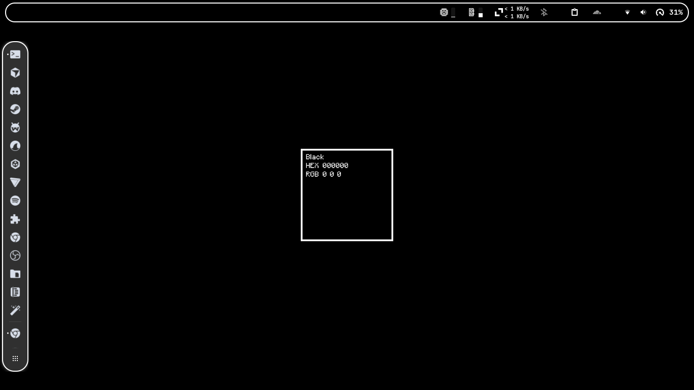
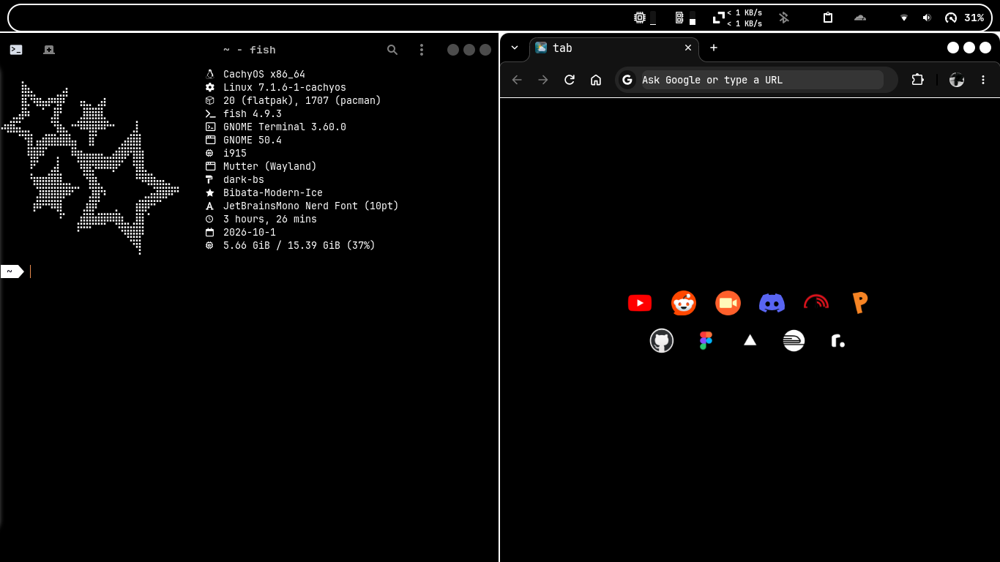

# Monochrome GNOME Rice 🖤

A clean, minimalist monochromatic setup for the GNOME desktop environment featuring the **Dark BS** theme, **YAMIS** monochrome icons, **Bibata Modern Ice** cursor, Libadwaita/GTK4 styling, and an automated installer script.

---

## 📸 Previews

<p align="center">
  
</p>

<p align="center">
  
</p>

---

## ✨ Features

- **GTK / Shell Theme:** [Dark BS](themes/dark-bs) (monochromatic dark aesthetic for GTK 2/3/4 & GNOME Shell)
- **Icon Theme:** [YAMIS](icons/YAMIS) (Yet Another Minimalist Icon Set)
- **Cursor Theme:** [Bibata-Modern-Ice](cursors/Bibata-Modern-Ice)
- **Libadwaita / GTK4 Support:** Pre-configured `gtk.css` overrides for consistent app styling
- **Automated Installer:** Fast setup across Arch, Debian/Ubuntu, Fedora, and openSUSE
- **Flatpak Theming:** Grants filesystem permissions for seamless theming in sandboxed apps
- **Fish Shell & Oh My Fish:** Includes JetBrains Mono font, Fish shell, and `agnoster` prompt setup

---

## 📦 Repository Structure

```
Monochrome-Gnome-Rice/
├── config/
│   ├── dconf/            # Exact saved GNOME extensions configuration
│   ├── gtk-3.0/          # GTK 3 custom styling and assets
│   └── gtk-4.0/          # GTK 4 / Libadwaita custom styling and assets
├── cursors/
│   └── Bibata-Modern-Ice/ # Cursor theme
├── icons/
│   └── YAMIS/             # Full monochromatic icon set
├── previews/              # Screenshots & showcase
│   ├── apps.png
│   └── desktop.png
├── themes/
│   └── dark-bs/           # Dark BS theme files (GTK 2/3/4, Shell, etc.)
├── wallpapers/
│   └── background.png     # Default monochrome wallpaper
├── install.sh             # Automated setup script
└── README.md
```

---

## 🚀 Quick Installation

Clone the repository and run the setup script:

```bash
git clone https://github.com/af44n/Monochrome-Gnome-Rice.git
cd Monochrome-Gnome-Rice
chmod +x install.sh
./install.sh
```

### 📋 Post-Installation Steps

1. **Log out and log back in** to ensure all GNOME extensions, shell themes, and shell environment variables take effect.
2. Open **GNOME Tweaks** → **Appearance** to verify:
   - **Cursor:** `Bibata-Modern-Ice`
   - **Icons:** `YAMIS`
   - **Shell / Legacy Applications:** `dark-bs`
3. Customize your extensions using the **Extensions** app.

---

## 🧩 Recommended GNOME Extensions

The installer automatically attempts to install and enable:
- [User Themes](https://extensions.gnome.org/extension/19/user-themes/)
- [Blur my Shell](https://extensions.gnome.org/extension/3193/blur-my-shell/)
- [Dash to Dock](https://extensions.gnome.org/extension/307/dash-to-dock/)
- [Just Perfection](https://extensions.gnome.org/extension/3843/just-perfection/)
- [Caffeine](https://extensions.gnome.org/extension/517/caffeine/)
- [Clipboard Indicator](https://extensions.gnome.org/extension/779/clipboard-indicator/)
- [Logo Menu](https://extensions.gnome.org/extension/4451/logo-menu/)
- [Space Bar](https://extensions.gnome.org/extension/5090/space-bar/)
- [Top Bar Organizer](https://extensions.gnome.org/extension/4356/top-bar-organizer/)
- [Top Hat](https://extensions.gnome.org/extension/5219/top-hat/)

---

## 📄 License

Individual components, themes, and icons belong to their respective creators and licenses. See internal directories for details.
